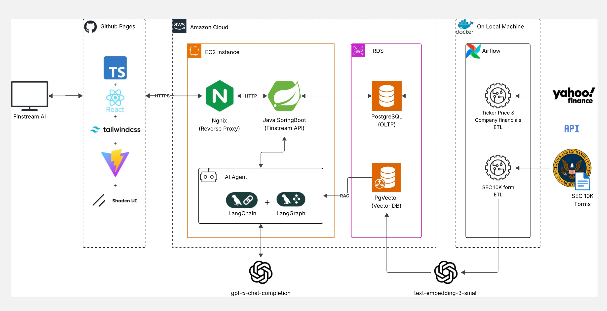

# 📈 FinStream AI

<div align="center">


**A modern, full-stack financial portfolio management platform with real-time market data, automated data pipelines, and Agentic RAG AI that turns SEC 10-K forms into actionable portfolio insights.**

[🌐 **Live Demo**](https://finstream.mohi-m.com) &nbsp;•&nbsp; [📡 **API Docs**](https://finstream-api.mohi-m.com/swagger-ui.html)

### Tech Stack

**AI / LLM Stack**  
[](https://www.langchain.com/)
[](https://langchain-ai.github.io/langgraph/) [](https://platform.openai.com/)

**Backend**  
[](https://spring.io/projects/spring-boot) [](https://openjdk.org/)

**Frontend**  
[](https://react.dev/) [](https://www.typescriptlang.org/)

**Data & Pipelines**  
[](https://www.postgresql.org/) [](https://github.com/pgvector/pgvector) [](https://airflow.apache.org/)

**Infrastructure**  
[](https://aws.amazon.com/)

</div>

---

## ✨ Features

<table>
<tr>
<td width="50%">

### 🤖 **Agentic RAG Portfolio Intelligence**

Generate portfolio and ticker commentary through a multi-step LangGraph workflow that retrieves relevant SEC 10-K chunks before producing grounded AI insights.

### 📚 **SEC Filing Knowledge Base**

Process 10-K filings with Airflow pipelines that download, extract, chunk, embed, and upsert filing sections into pgvector for retrieval-augmented analysis.

</td>
<td width="50%">

### 📊 **Real-Time Market + Financial Data**

Track S&P 500 companies with automated price ingestion, historical charting, and company financials surfaced in a unified research workflow.

### 💼 **Portfolio Management + Secure Access**

Create portfolios, manage holdings, review allocation analytics, and access the platform securely with Firebase-backed Google or GitHub sign-in.

</td>
</tr>
</table>

---

## 🏗️ Architecture



---

## 🖼️ Screenshots

<div align="center">
### Landing Page
> Modern, animated landing page with glassmorphism effects


### Stocks Dashboard

> Browse S&P 500 stocks with real-time price cards and watchlist management


### Stock Detail View

> Interactive price history charts with financial metrics


### Portfolio Management

> Create portfolios, visualize analytics and view AI insights


</div>
---

## 📁 Monorepo Structure

```
FinStream-AI/
├── 🎨 frontend/                  # Typescript + React Webpage
├── ⚙️ backend/                   # Spring Boot API + Agentic RAG AI
├── 🔄 airflow/                   # Data pipelines
└── 📊 data/                      # Seed scripts
```

---

## 🚀 Quick Start (Development)

Each part of the monorepo has its own setup guide:

- [Frontend README](frontend/README.md)
- [Backend README](backend/README.md)
- [Airflow README](airflow/README.md)
- [Seed Scripts README](data/seed/README.md)

---

## 📝 License

This project is licensed under the MIT License - see the [LICENSE](LICENSE) file for details.

---

<div align="center">

**[⬆ Back to Top](#-finstream-ai)**

</div>
